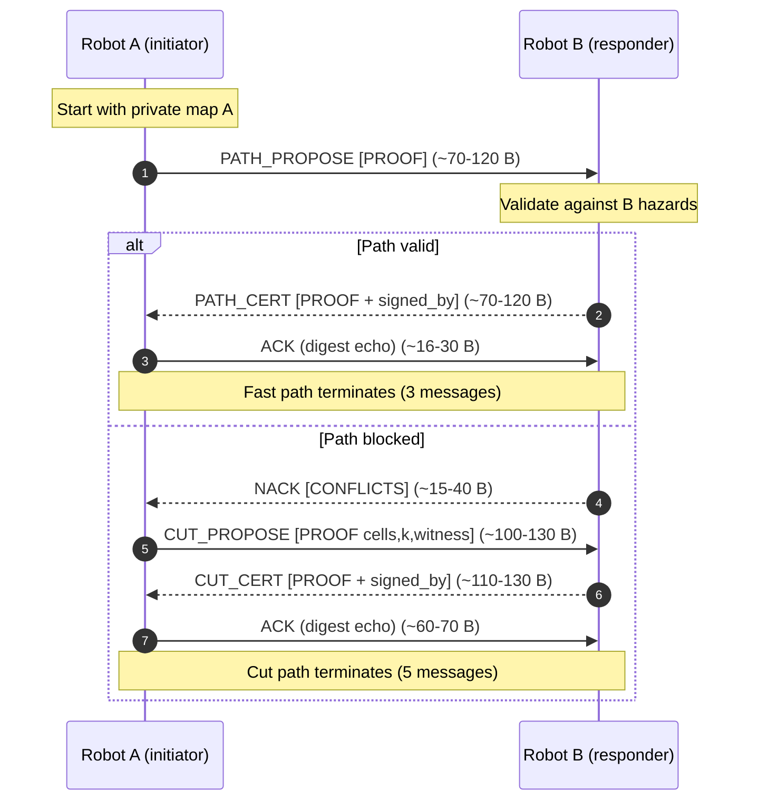
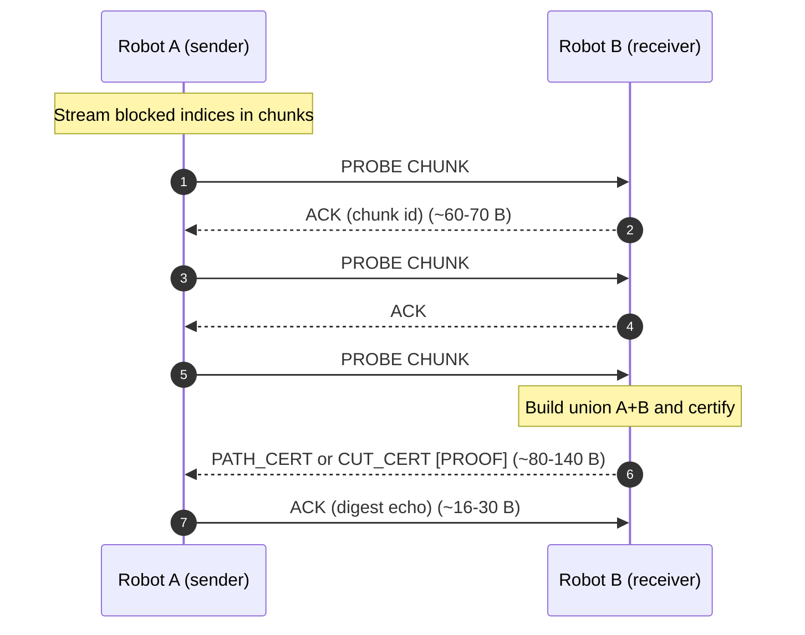
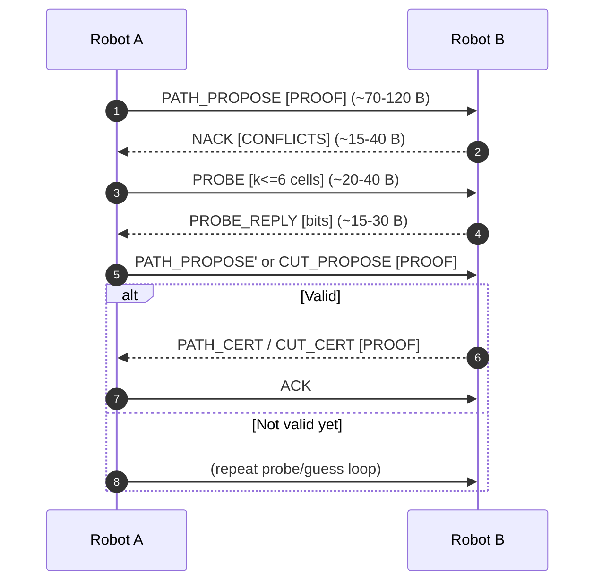
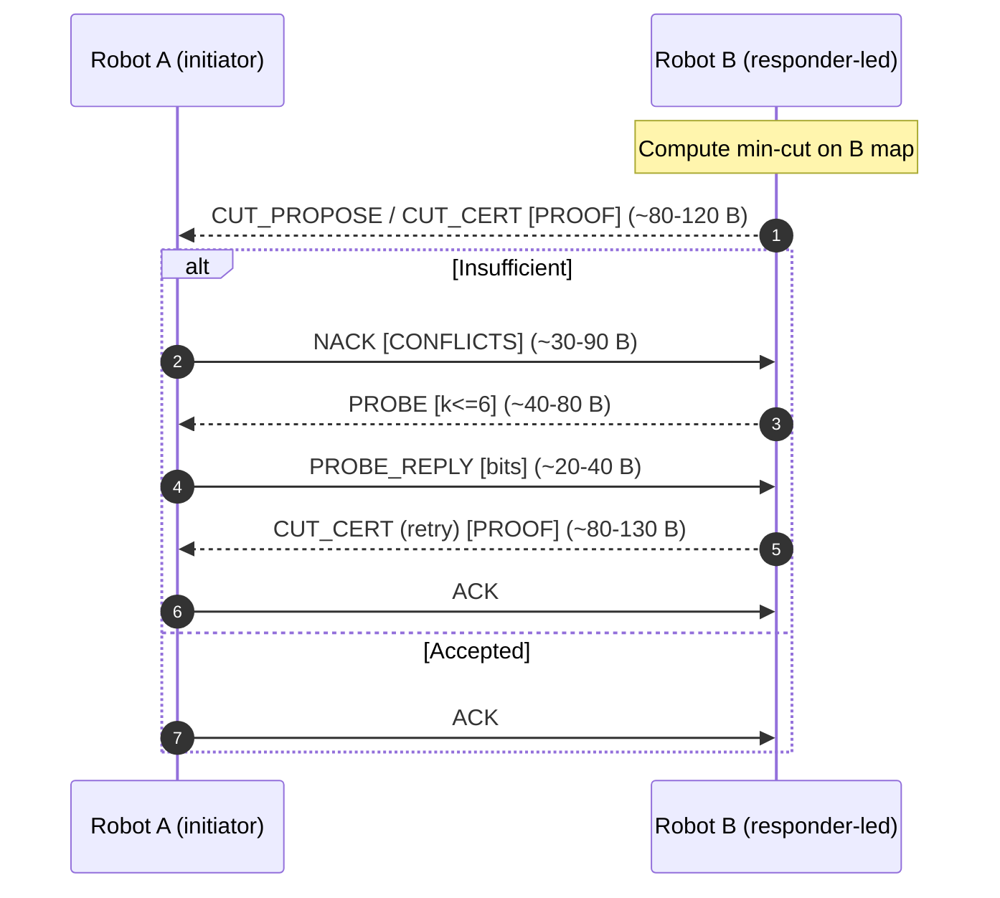

# Sequence Diagrams (Mermaid Source)

These are the exact Mermaid definitions for the four sequence diagrams now rendered as vector PDFs and included in the paper. Drop them into a Mermaid live editor or render locally with mermaid-cli to review or tweak the flows.

Build locally (PDF output):

```
# Ensure mermaid-cli is installed
npm install -g @mermaid-js/mermaid-cli

# Render all diagrams to cert-talk-paper/figs/*.pdf
./scripts/build_diagrams.sh
```

Direct one-off command (example):

```
mmdc -i diagrams/seq_certtalk.mmd -o cert-talk-paper/figs/seq_certtalk.pdf -b transparent -w 1400
```

---

## CertTalk (ours)



---

## Send-All (map streaming)



---

## Greedy-Probe (hint-first)



---

## Responder-MinCut (responder-led)



